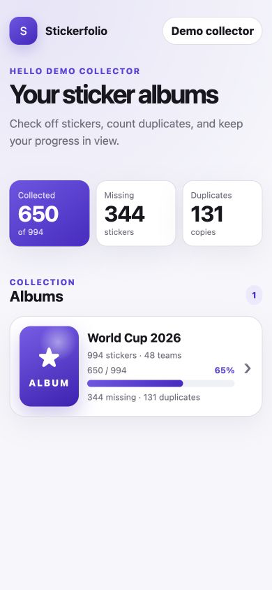
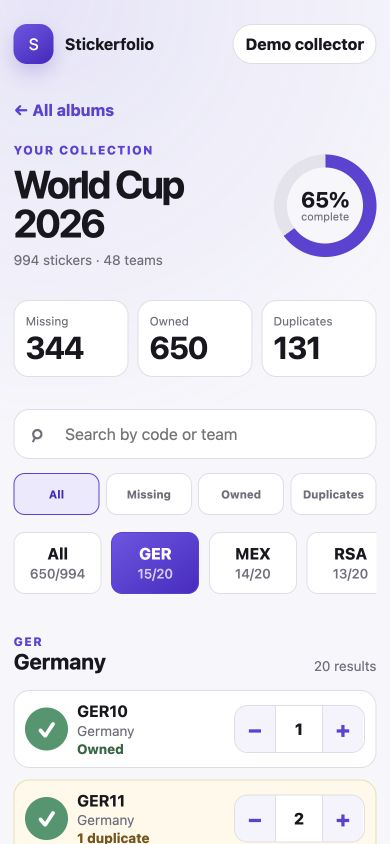
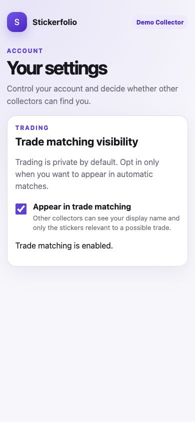
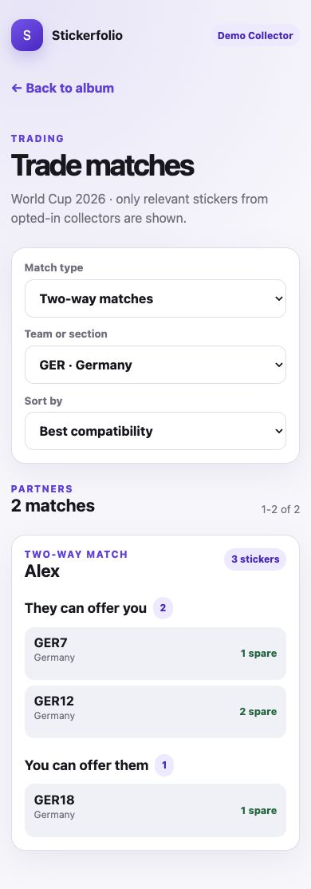

# Stickerfolio

Stickerfolio is a portable, mobile-first web application for managing sticker albums across independent collector accounts. Collectors can track several albums, record how many copies they own, export wanted and duplicate lists, and privately discover useful trade partners without exposing complete collections.

A quantity of zero means a sticker is missing, one means it is owned, and every additional copy is available as a duplicate. Shared catalog identities keep matching reliable even when collectors use different published revisions of the same album.

## Key features

- separate authenticated accounts and multiple albums per collector;
- mobile-friendly search, section filters, progress, and quantity controls;
- holding quantities from zero through 99, with every copy after the first counted as a duplicate;
- separate CSV exports for missing stickers and available duplicates;
- a complete, portable JSON export of a collector's own account and collection data;
- private, explicit opt-in trade matching with one-way and two-way results;
- expandable trade details, section filters, sorting, and pagination;
- configurable closed, invitation-only, or open registration;
- administrator-managed users and portable album templates;
- self-service account settings, deactivation, and permanent deletion;
- PostgreSQL persistence with bundled and external database options.

Trade matching is read-only. It shows an opted-in partner's display name and only the sticker codes relevant to a possible exchange—never login addresses, unrelated holdings, or complete foreign collections. Viewing a result does not reserve stickers or claim that a trade occurred.

Stickerfolio currently focuses on collection tracking, catalog administration, and private trade discovery. It does not provide in-app messaging, reservations, payments, or a public marketplace. Planned work and completed milestones are tracked in the [roadmap](docs/ROADMAP.md) and [GitHub issues](https://github.com/descipar/stickerfolio/issues).

## How collections work

Stickerfolio separates reusable album data from private collector data:

1. An administrator imports or selects an album catalog and publishes a reviewed revision.
2. A collector adds that published album to their account.
3. The collector records each sticker quantity from zero through 99.
4. Progress, missing stickers, duplicates, and CSV exports are calculated from those quantities.
5. If the collector opts in, compatible collections are compared using stable sticker identities.

Catalog revisions can correct codes or metadata without silently changing an existing personal collection. This keeps the application suitable for different publishers, sports, editions, and future albums rather than tying it to one checklist.

## Mobile interface

Stickerfolio is designed for quick checks while opening packs, sorting duplicates, and comparing collections.

| Album overview | Sticker and team view |
| --- | --- |
|  |  |

### Private trade matching

| Trading preference | Trade partners |
| --- | --- |
|  |  |

## Included album catalogs

The repository currently ships with two reviewed catalogs:

| Album | Edition | Tracked items |
| --- | --- | ---: |
| Panini FIFA World Cup 2026 | `2026 checklist edition` | 994 stickers in 50 sections |
| Topps UEFA EURO 2024 | `Standard German edition` | 707 physical sticker carriers in 43 sections |

These are bundled catalogs, not a hardcoded album limit. Administrators can import, review, and publish any custom album represented by a valid provider-neutral [version-1 album template](docs/ALBUM_TEMPLATE_FORMAT.md). See [Supported album catalogs](docs/SUPPORTED_ALBUMS.md) for exact scope and source notes.

## Quick start with Docker

Stickerfolio runs on standard Docker hosts, including ARM64 systems such as Raspberry Pi 4, x86-64 Linux servers, virtual machines, and self-managed cloud infrastructure.

Prerequisites:

- Git or another way to obtain the repository checkout;
- Docker Engine with Docker Compose v2;
- an unused TCP port, `3500` by default.

```bash
git clone https://github.com/descipar/stickerfolio.git
cd stickerfolio
./start.sh
```

The helper creates private local secrets, builds the standalone application and
operations images, starts PostgreSQL and Stickerfolio, applies migrations, and
loads the bundled empty catalogs. It does not create collector profiles,
personal albums, or example holdings.

If automatic address detection is unsuitable, set the externally used URL explicitly:

```bash
STICKERFOLIO_URL=http://192.168.20.102:3500 ./start.sh
```

> [!CAUTION]
> A new database contains the known bootstrap login `admin@stickerfolio.local` / `admin123!`. Do not make the instance publicly reachable until the administrator has signed in and changed this temporary password.

The application URL and bootstrap login are printed after startup. Running `./start.sh` again retains existing secrets and PostgreSQL data. Private-repository cloning, manual Compose setup, updates, external PostgreSQL, and platform notes are covered in [Deployment](docs/DEPLOYMENT.md).

External production databases should use `DATABASE_SSL_MODE=verify-full` with
the database provider's CA certificate. The weaker `require` mode encrypts the
connection without verifying the server identity and therefore does not protect
against a man-in-the-middle endpoint. See [Deployment](docs/DEPLOYMENT.md#external-postgresql)
for the complete configuration and trusted-private-network exceptions.

## Local development

Requirements:

- Node.js 22 or newer;
- pnpm 11;
- PostgreSQL 17;
- Docker when running the integration tests.

```bash
cp .env.example .env.local
pnpm install
# Edit .env.local and replace every placeholder before continuing.
set -a
source .env.local
set +a
pnpm db:migrate
pnpm dev
```

Replace every placeholder secret and database credential in `.env.local`
before exporting it into the current shell. Next.js loads `.env.local`
automatically, while standalone commands such as migrations and seeds read the
current process environment. Open `http://localhost:3500` after startup. See
[.env.example](.env.example) and [Deployment](docs/DEPLOYMENT.md) for the
complete configuration reference.

Run the standard validation suite with:

```bash
pnpm lint
pnpm typecheck
pnpm test
pnpm build
```

## Documentation

- [Deployment](docs/DEPLOYMENT.md) — Docker hosts, configuration, private cloning, updates, and database variants
- [Operations](docs/OPERATIONS.md) — migrations, backups, restores, health checks, and recovery
- [User guide](docs/USER_GUIDE.md) — accounts, collections, quantities, exports, and trade matching
- [Security](docs/SECURITY.md) — bootstrap exposure, trusted proxies, rate limits, cookies, and TLS
- [Seeding](docs/SEEDING.md) — bundled catalogs and the optional holdings example
- [Supported album catalogs](docs/SUPPORTED_ALBUMS.md) — reviewed catalog scope and counting rules
- [Album template format](docs/ALBUM_TEMPLATE_FORMAT.md) — portable catalog interchange contract
- [Application architecture](docs/ARCHITECTURE.md) — module boundaries, infrastructure, and revision model
- [Account lifecycle](docs/ACCOUNT_LIFECYCLE.md) — suspension, deletion, exports, and audit behavior
- [Password hashing](docs/PASSWORD_HASHING.md) — Argon2id parameters and constrained-host benchmark
- [Roadmap](docs/ROADMAP.md) — product decisions, implementation phases, and remaining work

## License

Stickerfolio is licensed under the [PolyForm Noncommercial License 1.0.0](LICENSE).

You may use, modify, and distribute this software for **noncommercial purposes** only, including personal, hobby, educational, research, nonprofit, and government use. **Commercial use is not permitted.** Copies and derivatives must retain the complete required attribution notice:

`Required Notice: Copyright 2026 Kai Schulte (https://github.com/descipar)`

This is a source-available license, not an OSI-approved open-source license. Contact the author for commercial licensing.
